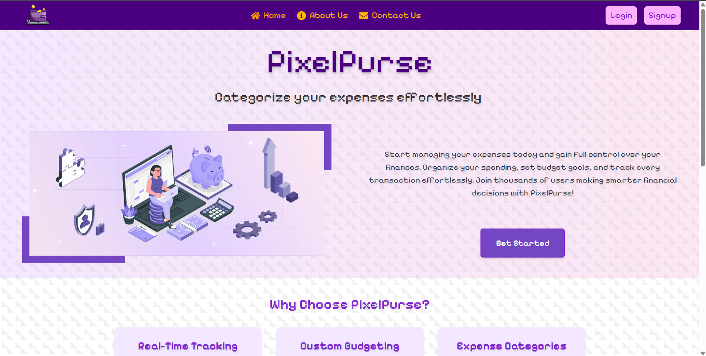
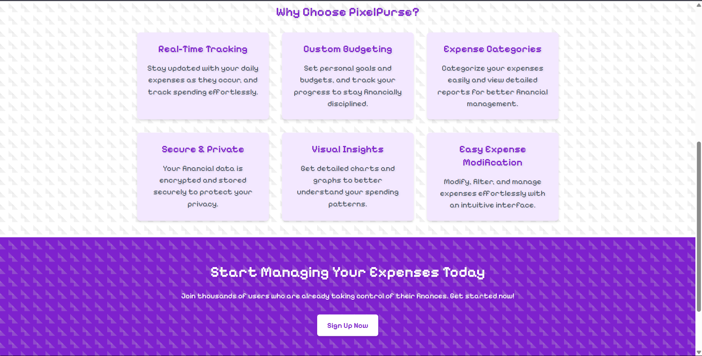
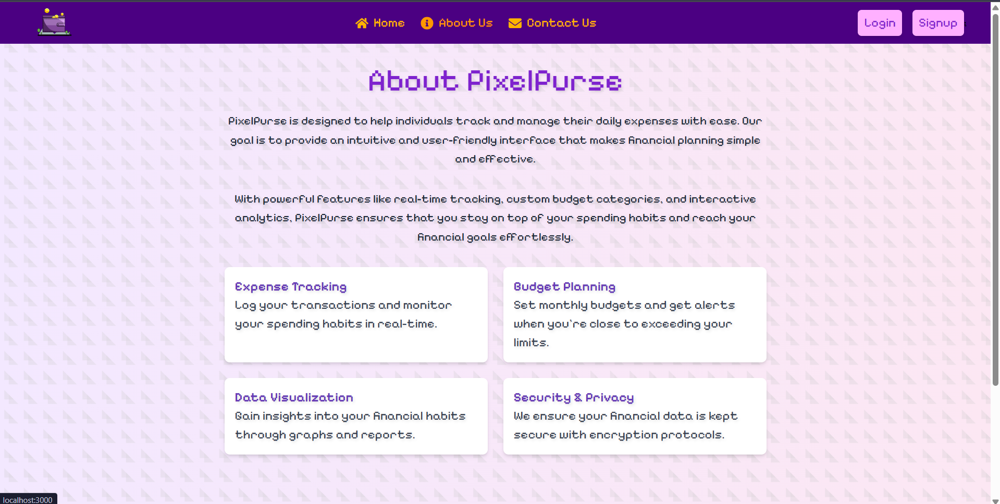

# PixelPurse

PixelPurse is a simple, intuitive expense tracker designed to help you manage your finances, track your spending, and visualize your budget with ease.

---

## 🚀 Features

- **Real-Time Expense Tracking:** Log transactions and monitor your spending habits instantly.
- **Custom Budget Categories:** Organize expenses into personalized categories.
- **Data Visualization:** Interactive charts and progress bars for clear financial insights.
- **Secure & Private:** Your data is encrypted and protected.
- **Easy Expense Modification:** Edit, filter, and manage your expenses effortlessly.
- **Responsive UI:** Pixel-inspired design for a modern, playful experience.

---

## 🖼️ Demo Screenshots







---

## 📦 Tech Stack

- **Frontend:** React, Redux, Tailwind CSS
- **Backend:** Node.js, Express, MongoDB
- **Authentication:** JWT, bcrypt
- **Email/OTP:** Nodemailer

---

## 🛠️ Getting Started

### Prerequisites

- Node.js & npm
- MongoDB (local or Atlas)

### Installation

```bash
git clone https://github.com/Divyanshu1864/PixelPurse.git
cd PixelPurse
npm install
cd server
npm install

```
Environment Variables
Create a .env file in server/ with:
```
MONGODB_URL=your_mongodb_connection_string
JWT_SECRET=your_jwt_secret
MAIL_HOST=your_smtp_host
MAIL_USER=your_email
MAIL_PASS=your_email_password
```
Running the App
Backend:
```
cd server
node index.js
```
Frontend:
```
npm start
```
Open http://localhost:3000 in your browser.

